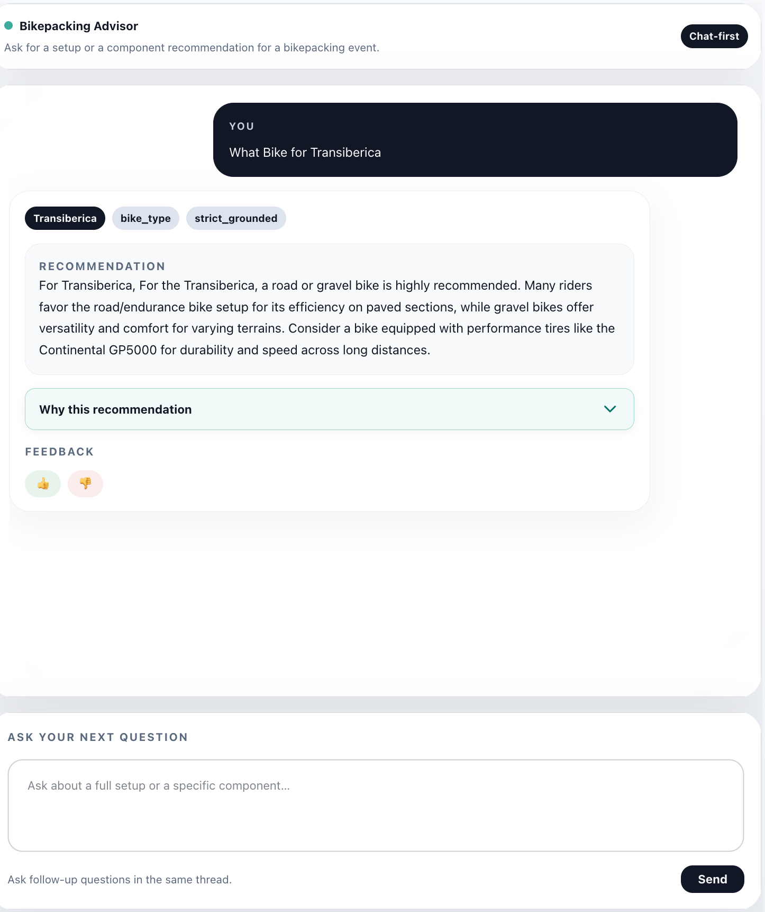
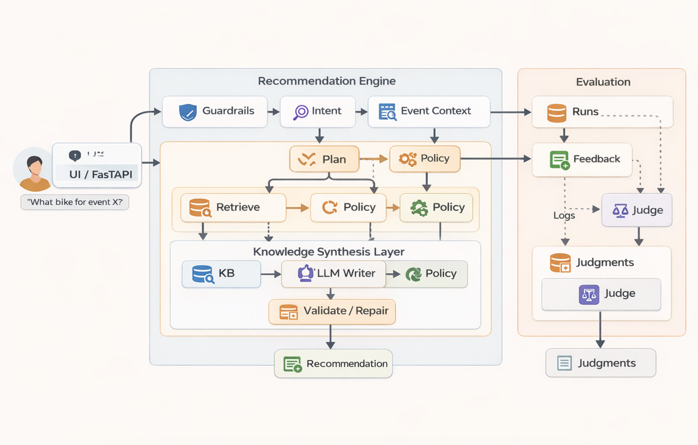

# 🚵‍♂️ bAIpacking Agent

## The problem

Bikepacking setup advice is scattered across race articles, rider interviews, and equipment lists. A reviewer or rider usually wants a fast answer to questions like:

- What bike setup worked for this event?
- What tyres, drivetrain, or bags fit this terrain?
- What do similar riders actually use when exact event evidence is limited?

This system turns that unstructured material into a searchable knowledge base and a grounded recommendation pipeline.




## How the system is organised


- The serving path ends at `Recommendation` and returns through the API
- `Data Eval`, `human feedback`, and `LLM Judge` are evaluation artifacts, not part of the live request path



## Knowledge Base And Retrieval

### Knowledge Base

The active knowledge base is stored in PostgreSQL and built from DotWatcher bikepacking articles and related event context.

Relevant pieces include:

- cleaned rider records
- article metadata
- rider chunks
- vector embeddings for retrieval

The main runtime retrieval path uses:

- `riders`
- `rider_chunks`
- `articles`
- pgvector-backed similarity search

### Retrieval Strategy

Retrieval is event-aware and tries to stay honest about grounding strength:

- `exact_event`
  - preferred when the resolved event has direct KB coverage
  - exact article titles and exact-scoped riders are used first
- `similar_event`
  - used when exact grounding is thin or unavailable but similar event families are reliable
- `unknown_global`
  - used when neither exact nor similar grounding is reliable enough

The recommender also tracks policy modes to set the "tone" of the recommendation and prevent hallucinations.

- `strict_grounded`
- `pattern_based`
- `generic_fallback`

Those policy modes control how much event-specific language and specificity the writer may use.


## Agents And LLM

The recommender is centered on `src/baikpacking/agents/recommender_agent.py` and the supporting modules under `src/baikpacking/agents/`.

The online request path is:

1. `POST /recommend` or the local CLI entrypoint
2. event resolution
3. query intent classification
4. guardrail check
5. event web context lookup
6. retrieval planning
7. similar-rider search in PostgreSQL / pgvector
8. evidence summarization
9. policy selection
10. optional review-hint lookup
11. writer draft generation
12. validation, optional repair, and postprocessing

The architecture is intentionally small:

- `event_resolution.py` resolves aliases and canonical event names
- `event_context_resolution.py` fetches event-level context from the web and derives event-family hints
- `retrieval_planning.py` builds the exact-vs-similar retrieval query plan
- `tools/riders.py` runs the actual rider retrieval against Postgres / pgvector
- `evidence_summary.py` summarizes evidence strength
- `policy.py` selects `strict_grounded`, `pattern_based`, or `generic_fallback`
- `review_feedback.py` loads optional scenario-review hints from `data/eval/scenario_reviews.jsonl`
- `writer_input.py` defines the writer-facing input contract
- `models.py` defines `WriterRecommendationDraft` and the final `SetupRecommendation`
- `postprocess.py` and `output_validation.py` assemble and validate the final output

The writer stage does not own the full final recommendation object. It produces a compact draft, and code assembles the final `SetupRecommendation`.


### Runtime And Eval Separation

The live API writes append-only telemetry to `data/eval/live_runs.jsonl` on every request, and the `/feedback` endpoint appends user feedback to `data/eval/live_feedback.jsonl`.

That data is then consumed by the offline judge in `src/baikpacking/eval/output_judge.py`, which reads live runs and feedback and writes judgments to `data/eval/output_judgments.jsonl`.

So the judge and feedback files are evaluation artifacts, not part of the serving-time recommendation loop.

## Repository Structure

Important directories and entrypoints:

- `src/baikpacking/agents/`
  - runtime orchestration, policy, postprocessing, validation, review feedback, and writer contracts
- `src/baikpacking/tools/`
  - rider retrieval, event context helpers, tracing, and pgvector search
- `src/baikpacking/pipelines/`
  - KB scraping, cleaning, loading, and embedding workflows
- `src/baikpacking/scraper/`
  - DotWatcher scraping and cleaning utilities
- `src/baikpacking/db/`
  - schema and database helpers
- `src/baikpacking/embedding/`
  - embedding configuration and Ollama client
- `src/baikpacking/apps/eval_dashboard.py`
  - local Streamlit eval dashboard
- `src/baikpacking/scripts/run_recommender.py`
  - runtime smoke path and sample eval row writer
- `src/baikpacking/scripts/run_eval_scenarios.py`
  - manual scenario evaluation runner
- `tests/`
  - unit, regression, writer, policy, retrieval, and scenario-eval tests
- `data/eval/`
  - scenario input/output artifacts, cached context, and human review JSONL files
- `archive/`
  - legacy code and older evaluation artifacts kept for reference

## Setup And Reproducibility

### 1. Install Dependencies

```bash
uv sync
```

### 2. Configure Environment

Create or edit `.env` with local values. Common variables include:

- `DATABASE_URL`
- `EMB_EMBEDDING_MODEL`
- `OLLAMA_HOST`
- `LOGFIRE_TOKEN`

### 3. Start Local Services

```bash
make pg-up
make ollama-up
```

If needed, set the embedding model before starting Ollama:

```bash
export EMB_EMBEDDING_MODEL=mxbai-embed-large:335m
```

For a one-shot local bootstrap, `make dev` is available.

## Run The KB Pipeline

The active KB flow is:

```text
scrape -> clean -> load -> embed
```

Run the full pipeline:

```bash
make kb-update
```


## Run The Recommender

Run the current runtime entrypoint:

```bash
uv run python -m baikpacking.scripts.run_recommender
```

This prints:

- the recommendation
- the retrieved grounding riders
- the tool trace

It also appends a small runtime eval row to `data/eval/sample_eval_rows.jsonl`.

## HTTP API

The repository now includes a small FastAPI wrapper around the existing
recommendation pipeline.

Run it locally:

```bash
uv run uvicorn baikpacking.api.main:app --host 0.0.0.0 --port 8000
```

Run it in Docker:

```bash
docker build -t baikpacking-api .
docker run --rm -p 8000:8000 --env-file .env baikpacking-api
```

Quick curl examples:

```bash
curl http://localhost:8000/health
curl http://localhost:8000/ready
curl -X POST http://localhost:8000/recommend \
  -H 'Content-Type: application/json' \
  -d '{"query":"What tyres should I use for Atlas Mountain Race?","include_debug":true}'
```

The `POST /recommend` response includes the query, resolved event, intent,
recommendation, evidence, policy, and optional debug trace data.
`GET /health` is a liveness check; `GET /ready` verifies database connectivity.
Each live `/recommend` request also appends a deterministic live-eval row to
`data/eval/live_runs.jsonl`.

## Reflex UI

A local Reflex frontend lives in `apps/reflex_ui/`.

Run it with the backend API running locally:

```bash
cd apps/reflex_ui
API_BASE_URL=http://127.0.0.1:8000 uv run reflex run
```

The UI renders the `/recommend` response as a chat-first assistant with
collapsed technical details. See `apps/reflex_ui/README.md` for a shorter
setup note.

## Testing

The test suite lives under `tests/`.

Run everything:

```bash
uv run pytest
```

Useful focused subsets:

```bash
uv run pytest tests/test_event_resolution.py tests/test_event_context_resolution.py tests/test_retrieval_planning.py
uv run pytest tests/test_policy.py tests/test_writer_stage.py tests/test_agents_writer_input.py
uv run pytest tests/test_eval_scenario_content_assertions.py tests/test_review_feedback.py
uv run pytest tests/test_riders.py tests/test_recommender.py
```

What these tests cover:

- event resolution and alias handling
- event context and retrieval planning
- rider retrieval and evidence summarization
- policy selection and fallback behavior
- writer-stage contract stability
- manual scenario assertions
- human review storage and matching

## Evaluation

Evaluation is deterministic first, with optional human review on top.

### Manual Scenario Evaluation

The manual scenario contract lives in:

- `data/eval/manual_scenarios.yaml`

Run the scenario suite with:

```bash
uv run python -m baikpacking.scripts.run_eval_scenarios
```

That runner writes per-scenario results to:

- `data/eval/scenario_runs.jsonl`

Each run records:

- scenario contract fields
- resolved event and intent
- retrieval source and policy mode
- content assertion results
- event alignment assertion results
- failure kind and runtime/schema stability

The current deterministic checks cover:

- content assertions
- event alignment
- schema/runtime stability
- failure classification such as `output_schema_failure`

There is no LLM judge in this flow.

### Eval Dashboard

Open the local eval dashboard with:

```bash
uv run streamlit run src/baikpacking/apps/eval_dashboard.py
```

The dashboard reads:

- `data/eval/scenario_runs.jsonl`

It shows:

- summary cards
- failure and issue breakdowns
- drill-down rows
- selected-row details

### Human Review Loop

The dashboard also supports reviewer feedback.

Saved reviews are stored separately in:

- `data/eval/scenario_reviews.jsonl`

Each review can include:

- `review_status`
- `human_label`
- `corrected_event`
- `corrected_component`
- `corrected_policy_mode`
- `review_notes`

The recommender loads matching review hints at runtime for the same event/component combination and uses them as prompt context. Reviews are not treated as hard labels or a learned model.

## Monitoring And Tracing

The project has developer-facing tracing, not a full production monitoring stack.

Available instrumentation:

- `src/baikpacking/logging_config.py` configures standard logging and Logfire
- `pydantic_ai` instrumentation captures agent runs and tool calls
- `src/baikpacking/tools/call_trace.py` records tool-call traces in the runtime path
- `src/baikpacking/scripts/run_recommender.py` prints the tool trace and stores a sample runtime eval row
- `make kb-status` gives a quick DB health check by counting riders and embeddings

Typical inspection flow:

```bash
uv run python -m baikpacking.scripts.run_recommender
make kb-status
```

If `LOGFIRE_TOKEN` is configured, inspect traces in Logfire. Otherwise tracing remains local.


## Want to review the system? 

- Run the recommender: `uv run python -m baikpacking.scripts.run_recommender`
- Run eval: `uv run python -m baikpacking.scripts.run_eval_scenarios`
- Open the dashboard: `uv run streamlit run src/baikpacking/apps/eval_dashboard.py`
- Inspect eval output: `data/eval/scenario_runs.jsonl`
- Inspect reviewer feedback: `data/eval/scenario_reviews.jsonl`
- Inspect runtime smoke logs: `data/eval/sample_eval_rows.jsonl`
